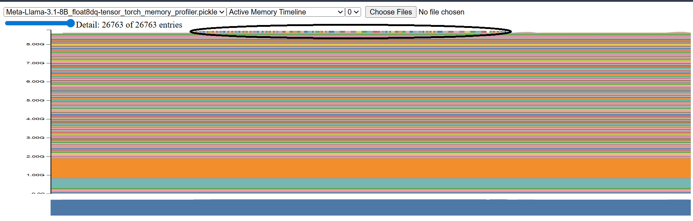
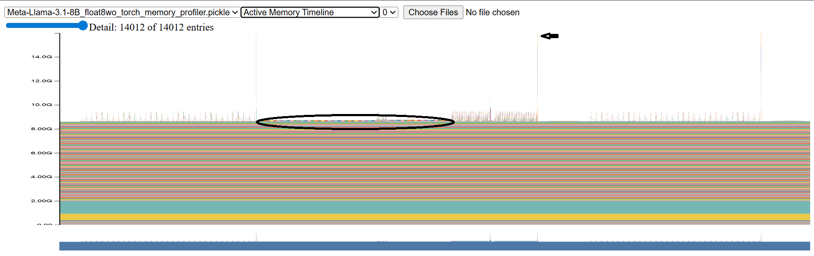

# Worklog for TorchAO's Float8WeightOnlyConfig Inference Slowdown Profiling
## The Problem:
TorchAO's Float8WeightOnlyConfig has a massive **decrease in inference throughput**, **low memory bandwidth utilization**, and **high peak VRAM** usage.          

TorchAO issue raised after I discovered this problem while working on a [survey of quantization formats](https://github.com/vipulSharma18/Survey-of-Quantization-Formats?tab=readme-ov-file#benchmarking-results): [TorchAO GH Issue](https://github.com/pytorch/ao/issues/3288).            

_Example:_ Meta-Llama-3.1-8B inference.

Model is 15.01GB in size in bf16. Computation in mixed precision with torch.bfloat16.      
GPU is RTX5090 with 34GB VRAM and peak theoretical memory bandwidth of 1792 GB/sec.       
Batch size is 1, so possibly a GEMV kernel is being used and the inference is memory bound.       
We follow GPT-Fast and only compile the decode stage of the inference.      

**No quantization**:        
tok/s=104.68, tok/s_decode=105.73, ttft=0.0186, mem/s=1571.23 GB/s, peak_mem=16.30 GB, model_size=15.01 GB         

**float8dq-tensor quantization**:       
tok/s=160.55, tok/s_decode=169.80, ttft=0.0675, mem/s=1204.97 GB/s, peak_mem= 9.21 GB, model_size= 7.51 GB           

**float8wo quantization**:      
**tok/s=7.44**, tok/s_decode=7.48, ttft=0.1442, **mem/s=55.91 GB/s**, **peak_mem=26.00 GB**, model_size= 7.51 GB         

**The 3 performance limitations:**
* Decrease in inference throughput: 7.44 tps v/s 105.73 tps of baseline.
* Low memory bandwidth utilization: 55.91 GB/s v/s peak theoretical 1792 GB/s.
* Peak VRAM usage: 26.00 GB v/s 16.30 of the baseline.

## The initial PyTorch Trace:
As a first, and possibly only step, we use the GPT-Fast benchmark provided by TorchAO to profile the memory and execution of the above 3 settings.

## Torch Memory Profile

The 0-th inference iteration is profiled with CUDA memory snapshot. The snapshots are available at the following paths: `llama_benchmark/Meta-Llama-3.1-8B_None_torch_memory_profiler.pickle`, `llama_benchmark/Meta-Llama-3.1-8B_float8dq-tensor_torch_memory_profiler.pickle`, `llama_benchmark/Meta-Llama-3.1-8B_float8wo_torch_memory_profiler.pickle`.

  
  
<strong>Figure 1:</strong> Baseline Whole Timeline

  
  
<strong>Figure 2:</strong> FP8 Weights and Activations DQ Whole Timeline

  
  
<strong>Figure 3:</strong> FP8 Weights Only Static Quantization Whole Timeline

On first look, comparing the whole timelines in Figures 1, 2, and 3, we can notice that they all have some blocks of memory in the middle of the timeline (encircled). Also, Float8WO has multiple spikes in memory that are not present in the other two snapshots (marked by arrow).

## Torch Execution Trace
### Baseline

### FP8 Static Weights and Dynamic Activations Quantization

### FP8 Static Weights Only Quantization

If needed, we can proceed to gather more information via NSYS and NCU profiling (to be decided).